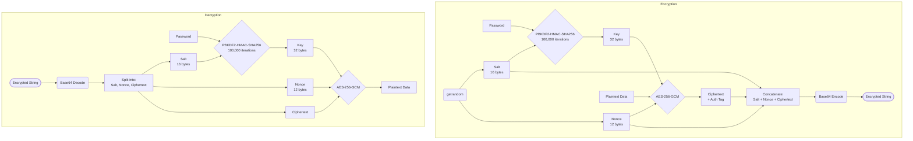

# [WASM-Cipher](https://rei-ashine.github.io/wasm-cipher/)

DATE: 2026-07-07


## Security Update
This application has been migrated from AES-CBC to the **AES-GCM** (Galois/Counter Mode) authenticated encryption algorithm for enhanced security.
- Data integrity checks are now performed automatically upon decryption, preventing tampering.
- Employs modern WebAssembly (`wasm-pack`) + Rust cryptographic libraries (`aes-gcm`, `pbkdf2`).

## Diagram


```mermaid
flowchart TD
    subgraph Encryption
        P1[Password]
        D1[Plaintext Data]
        
        S1[Salt <br/>16 bytes]
        N1[Nonce <br/>12 bytes]
        
        RNG1(getrandom) --> S1
        RNG1 --> N1
        
        P1 --> KDF1{PBKDF2-HMAC-SHA256 <br/> 100,000 iterations}
        S1 --> KDF1
        KDF1 --> Key1[Key <br/>32 bytes]
        
        Key1 --> AES1{AES-256-GCM}
        N1 --> AES1
        D1 --> AES1
        
        AES1 --> C1[Ciphertext <br/> + Auth Tag]
        
        S1 --> Concat1[Concatenate: <br/> Salt + Nonce + Ciphertext]
        N1 --> Concat1
        C1 --> Concat1
        
        Concat1 --> B64_1(Base64 Encode)
        B64_1 --> Out1([Encrypted String])
    end
    
    subgraph Decryption
        In2([Encrypted String])
        P2[Password]
        
        In2 --> B64_2(Base64 Decode)
        B64_2 --> Split2[Split into: <br/> Salt, Nonce, Ciphertext]
        
        Split2 --> S2[Salt <br/>16 bytes]
        Split2 --> N2[Nonce <br/>12 bytes]
        Split2 --> C2[Ciphertext]
        
        P2 --> KDF2{PBKDF2-HMAC-SHA256 <br/> 100,000 iterations}
        S2 --> KDF2
        KDF2 --> Key2[Key <br/>32 bytes]
        
        Key2 --> AES2{AES-256-GCM}
        N2 --> AES2
        C2 --> AES2
        
        AES2 --> D2[Plaintext Data]
    end
```

## Directory Structure
```
.
├── .github
│   ├── dependabot.yml
│   └── workflows
│       └── static.yml
├── .gitignore
├── Cargo.lock
├── Cargo.toml
├── PNG
│   ├── Diagram_EncryptionTool.png
│   └── EncryptionTool.png
├── README.md
├── src
│   ├── cipher.rs
│   └── lib.rs
└── www
    ├── .gitignore
    ├── bootstrap.js
    ├── index.html
    ├── index.js
    ├── package-lock.json
    ├── package.json
    ├── public
    │   ├── assets
    │   ├── css
    │   └── html
    ├── README.md
    └── webpack.config.js
```
---
```
===============================================================================
 Language                     files          blank        comment           code
===============================================================================
 JSON                             2              0              0           3727
 HTML                             3             37             23            257
 JavaScript                       4             34              7            196
 CSS                              1             25             17            114
 Rust                             2             28              0             97
 Markdown                         2             25              0             94
 YAML                             3              8             10             61
 TOML                             1              2              0             14
===============================================================================
 SUM:                            18            159             57           4560
===============================================================================
```

## Reference
- [『高効率言語 Rust 書きかた・作りかた』](https://www.socym.co.jp/book/1351)


