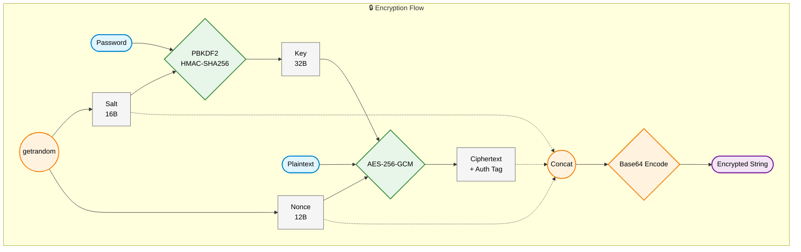
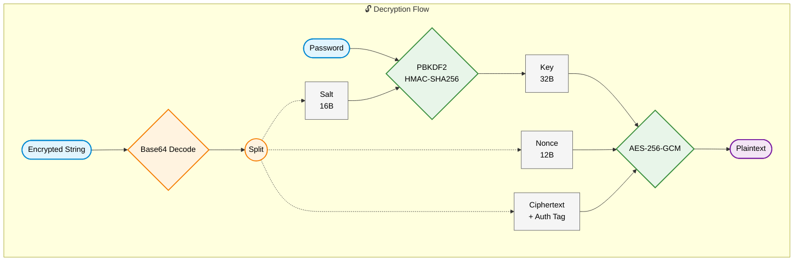

# [WASM-Cipher](https://rei-ashine.github.io/wasm-cipher/)

DATE: Jul. 8th, 2026


## Security Update

This application has been migrated from AES-CBC to the **AES-GCM** (Galois/Counter Mode) authenticated encryption algorithm for enhanced security.

- Data integrity checks are now performed automatically upon decryption, preventing tampering.
- Employs modern WebAssembly (`wasm-pack`) + Rust cryptographic libraries (`aes-gcm`, `pbkdf2`).

## UI & UX Enhancements

- **Smart Copy**: Output area features a modern, responsive clipboard SVG icon. Clicking anywhere on the output area copies the text to the clipboard and provides a visual checkmark confirmation.
- **Safer Swap**: The Swap button securely transfers output to the input field and clears the output area, making iterative operations seamless.
- **Resilient Error Handling**: Transient error messages disappear automatically, and previous valid output states are restored without data loss.

## Diagram


```mermaid
flowchart LR
    %% Styling definitions
    classDef input fill:#E1F5FE,stroke:#0288D1,stroke-width:2px,color:#000
    classDef process fill:#FFF3E0,stroke:#F57C00,stroke-width:2px,color:#000
    classDef crypto fill:#E8F5E9,stroke:#388E3C,stroke-width:2px,color:#000
    classDef output fill:#F3E5F5,stroke:#7B1FA2,stroke-width:2px,color:#000
    classDef data fill:#F5F5F5,stroke:#616161,stroke-width:1px,color:#000

    subgraph Enc [🔒 Encryption Flow]
        direction LR
        P([Password]):::input
        T([Plaintext]):::input
        
        R((getrandom)):::process --> S[Salt <br>16B]:::data
        R --> N[Nonce <br>12B]:::data
        
        P --> KDF{PBKDF2 <br>HMAC-SHA256}:::crypto
        S --> KDF
        KDF --> K[Key <br>32B]:::data
        
        K --> AES{AES-256-GCM}:::crypto
        N --> AES
        T --> AES
        AES --> C[Ciphertext <br>+ Auth Tag]:::data
        
        S -.-> Concat((Concat)):::process
        N -.-> Concat
        C -.-> Concat
        
        Concat --> B64{Base64 Encode}:::process
        B64 --> Out([Encrypted String]):::output
    end
```


```mermaid
flowchart LR
    %% Styling definitions
    classDef input fill:#E1F5FE,stroke:#0288D1,stroke-width:2px,color:#000
    classDef process fill:#FFF3E0,stroke:#F57C00,stroke-width:2px,color:#000
    classDef crypto fill:#E8F5E9,stroke:#388E3C,stroke-width:2px,color:#000
    classDef output fill:#F3E5F5,stroke:#7B1FA2,stroke-width:2px,color:#000
    classDef data fill:#F5F5F5,stroke:#616161,stroke-width:1px,color:#000

    subgraph Dec [🔓 Decryption Flow]
        direction LR
        In([Encrypted String]):::input
        P2([Password]):::input
        
        In --> B64D{Base64 Decode}:::process
        B64D --> Split((Split)):::process
        
        Split -.-> S2[Salt <br>16B]:::data
        Split -.-> N2[Nonce <br>12B]:::data
        Split -.-> C2[Ciphertext <br>+ Auth Tag]:::data
        
        P2 --> KDF2{PBKDF2 <br>HMAC-SHA256}:::crypto
        S2 --> KDF2
        KDF2 --> K2[Key <br>32B]:::data
        
        K2 --> AES2{AES-256-GCM}:::crypto
        N2 --> AES2
        C2 --> AES2
        AES2 --> Out2([Plaintext]):::output
    end
```

## Directory Structure

```text
.
├── .github
│   ├── dependabot.yml
│   └── workflows
│       └── static.yml
├── .gitignore
├── Cargo.lock
├── Cargo.toml
├── PNG
│   ├── Diagram_EncryptionTool.png
│   └── EncryptionTool.png
├── README.md
├── src
│   ├── cipher.rs
│   └── lib.rs
└── www
    ├── .gitignore
    ├── bootstrap.js
    ├── index.html
    ├── index.js
    ├── package-lock.json
    ├── package.json
    ├── public
    │   ├── assets
    │   ├── css
    │   └── html
    ├── README.md
    └── webpack.config.js
```

---

```text
-------------------------------------------------------------------------------
Language                     files          blank        comment           code
-------------------------------------------------------------------------------
JSON                             2              0              0           3727
HTML                             3             37             23            263
JavaScript                       4             44              6            225
Markdown                         2             44              0            162
CSS                              1             28             17            137
Rust                             2             28              0             97
YAML                             3              8             10             61
TOML                             1              2              0             14
-------------------------------------------------------------------------------
SUM:                            18            191             56           4686
-------------------------------------------------------------------------------
```

## Reference

- [『高効率言語 Rust 書きかた・作りかた』](https://www.socym.co.jp/book/1351)


